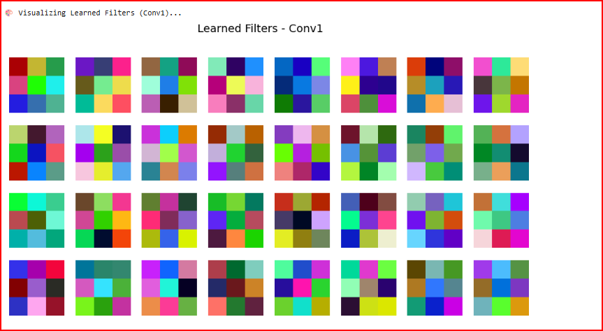

# Visualizing Feature Maps and Filters  
**Course:** Deep Learning  
**Instructor:** Dr. Osama  
**Student:** Qasim Naveed  
**Environment:** Google Colab (T4 GPU / CPU)

---

## 📘 Objective
This task demonstrates how a **Convolutional Neural Network (CNN)** processes and understands images internally.  
By visualizing **feature maps** and **learned filters**, we gain insight into what patterns the CNN focuses on at each layer — from simple edges to complex textures.

---

## 🧩 Question Statement

> **Q12. Visualizing Feature Maps and Filters**  
>  
> 1️⃣ Select one input image from your test set.  
> 2️⃣ Visualize intermediate feature maps from your first and second convolutional layers.  
> 3️⃣ Plot several learned filters (kernels) to show what features the CNN has learned.  
> 4️⃣ Briefly interpret which kinds of features are detected at each layer (edges, textures, etc.)

---

## ⚙️ Environment Setup

### 🔧 Requirements
To execute this experiment, use **Google Colab** or a local environment with the following dependencies installed:
```bash
pip install torch torchvision matplotlib numpy
```

### 🖥️ Recommended Runtime
- **GPU:** NVIDIA T4 (optional but faster)  
- **Framework:** PyTorch  
- **Dataset:** CIFAR-10  

---

## 🧱 Implementation Steps

### **Step 1: Load Dataset**
- Dataset: **CIFAR-10**
- Contains 60,000 color images across 10 classes (e.g., plane, car, bird, cat, etc.)
- A single **test image** is selected for visualization.

🖼️ **Original Test Image**  
*Input image selected from test set before passing through CNN.*


---

### **Step 2: Define CNN Model**
A simple CNN model with two convolutional layers is implemented.  
It is sufficient for observing how convolution layers learn progressively complex representations.

**Model Architecture:**
- **Conv1:** 3 → 32 filters (kernel size 3x3)
- **Conv2:** 32 → 64 filters (kernel size 3x3)
- **Pooling:** MaxPool (2x2)
- **FC1 & FC2:** Fully connected layers for classification

---

### **Step 3: Visualize Feature Maps**

Feature maps are the **output activations** of each convolutional layer, showing how the CNN perceives features in the image.

#### 🔹 Conv1 Feature Maps
- Detects **edges, color gradients, and simple lines**.  
- Represents **low-level spatial features**.


#### 🔹 Conv2 Feature Maps
- Detects **textures, corners, and object components**.  
- Represents **higher-level and abstract features** formed by combining Conv1 outputs.


---

### **Step 4: Visualize Learned Filters**
Filters (or kernels) are the **learned weights** of the convolutional layers.  
Each filter acts as a pattern detector — identifying edges, textures, and specific shapes in the image.

🖼️ **Learned Filters - Conv1**  
Each patch represents one filter’s learned feature pattern.



---

## 🧠 Interpretation

| Layer | Features Detected | Description |
|--------|------------------|--------------|
| **Conv1** | Edges, corners, and gradients | Learns low-level features from the raw image, detecting outlines and simple structures. |
| **Conv2** | Textures, curves, and object parts | Builds upon Conv1 outputs to recognize complex shapes and detailed patterns. |
| **Filters (Kernels)** | Learned pattern detectors | Each filter adapts to specific orientations, colors, and structures useful for classification. |

---

### **Hierarchical Learning in CNNs**
1. **First Layer (Conv1):** Detects simple features — edges and colors.  
2. **Second Layer (Conv2):** Combines simple features into patterns and object parts.  
3. **Deeper Layers (if present):** Form semantic concepts — such as shapes, textures, and full objects.  

> The deeper we go, the more abstract and meaningful the learned representations become.

---

## 📊 Results Summary

| Output Image | Description |
|---------------|-------------|
| **1.png** | Original test image selected from CIFAR-10 |
| **2.png** | Feature maps of Conv1 showing low-level activations |
| **3.png** | Feature maps of Conv2 showing texture and pattern activations |
| **4.png** | Learned Conv1 filters (kernels) visualized in RGB |

---

## 🧰 Tools and Technologies
- **Language:** Python 3.10+  
- **Framework:** PyTorch  
- **Libraries:** Torchvision, Matplotlib, NumPy  
- **Platform:** Google Colab  

---

## 🧾 Conclusion
This visualization demonstrates how CNNs learn to **transform raw pixel data into meaningful visual representations**:

- **Conv1:** Detects basic geometric shapes (edges, lines).  
- **Conv2:** Captures complex visual textures and object parts.  
- **Filters:** Represent unique learned visual patterns that CNNs use to classify images.

By analyzing these visualizations, we can better understand **how neural networks “see” and interpret images**, bridging the gap between **black-box learning** and **human interpretability**.

---

## 📚 References
- [PyTorch Documentation](https://pytorch.org/docs/stable/index.html)  
- [Torchvision Datasets](https://pytorch.org/vision/stable/datasets.html)  
- [Stanford CS231n - Understanding CNNs](https://cs231n.github.io/understanding-cnn/)  
- [Deep Learning Specialization - Coursera](https://www.coursera.org/specializations/deep-learning)

---

## 👨‍💻 Author
**Qasim Naveed**  
Deep Learning Enthusiast | Computer Science Student  
📘 *Instructor:* Dr. Osama  
💻 *Task:* CNN Feature Map and Filter Visualization  

🌐 [LinkedIn Profile](https://www.linkedin.com/in/qasimnaveed)  
> “Learning Deep Learning — one layer at a time.”
